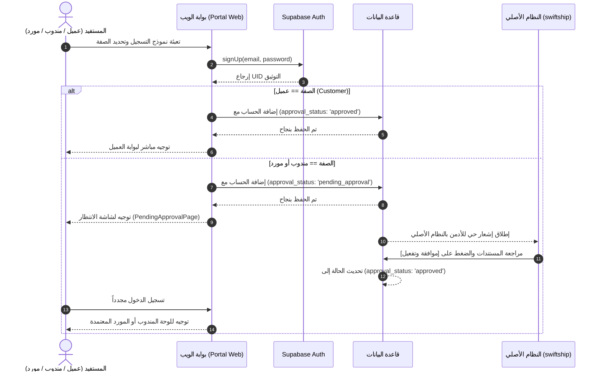

# الخطة الهندسية الشاملة والمفصلة لإنشاء موقع الشركة وبوابات المستفيدين (Developer Architecture Plan)

تعد هذه الخطة مرجعاً تقنياً وتنفيذياً دقيقاً وموجهاً للمبرمجين والمطورين لفهم معمارية موقع الويب وبوابات الخدمات الذاتية (العميل، المندوب، المورد)، وربطه التام بقاعدة بيانات وتصاميم نظام **swiftship** الأصلي.

---

## 1. شجرة الهيكل التنظيمي للملفات والمسارات (Project & Directory Architecture)

تُبنى البوابة كمواجهة حديثة ومتكاملة ضمن مشروع React / TypeScript الحالي لتضمن الاستفادة من المكونات الأساسية وتفادي تكرار الكود.

```text
src/
├── portal/                          # مجلد بوابة الويب والموقع الخارجي الموحد
│   ├── components/                  # المكونات الخاصة بالبوابة
│   │   ├── common/                  # مكونات مشتركة (Header, Footer, ThemeToggle, LangToggle, GlobalSearch)
│   │   ├── landing/                 # مكونات الواجهة الرئيسية (Hero, Services, Features, Stats, GlobalMap, Offers)
│   │   ├── customer/                # مكونات العميل (OrderFormModal, CustomerLedgerTable, OrderTracker)
│   │   ├── courier/                 # مكونات المندوب (TaskCard, DeliveryProofModal, CourierEarningsTable)
│   │   └── supplier/                # مكونات المورد (FactoryOrderCard, CbmUpdateModal, SupplierLedgerTable)
│   ├── context/                     # سياق إدارة الجلسة والبيانات
│   │   ├── PortalAuthContext.tsx    # حارس المصادقة وحالة الحساب والاعتماد
│   │   └── PortalThemeContext.tsx   # إدارة المظهر واللغة
│   ├── hooks/                       # الخطاطيف المخصصة (Custom Hooks)
│   │   ├── usePortalAuth.ts         # إدارة تسجيل الدخول والإنشاء والحالة
│   │   ├── usePortalOrders.ts       # جلب وتتبع الطلبات المخصصة للمستخدم
│   │   ├── usePortalLedger.ts       # جلب كشوفات الحساب المالية المفلترة
│   │   └── usePortalTickets.ts      # إدارة تذاكر الدعم والشكاوى
│   ├── pages/                       # الشاشات الرئيسية للبوابة
│   │   ├── landing/                 # LandingPage.tsx (الواجهة العامة)
│   │   ├── auth/                    # LoginPage.tsx, RegisterPage.tsx, PendingApprovalPage.tsx
│   │   ├── customer/                # CustomerDashboard.tsx, NewOrderPage.tsx, MyOrdersPage.tsx, CustomerLedgerPage.tsx
│   │   ├── courier/                 # CourierDashboard.tsx, CourierTasksPage.tsx, CourierLedgerPage.tsx
│   │   ├── supplier/                # SupplierDashboard.tsx, FactoryOrdersPage.tsx, SupplierLedgerPage.tsx
│   │   └── shared/                  # ProfilePage.tsx, AnnouncementsPage.tsx, SupportTicketsPage.tsx
│   ├── services/                    # خدمات الاتصال بقاعدة البيانات
│   │   ├── portalAuthService.ts     # عمليات الدخول والتسجيل والاعتماد
│   │   ├── portalOrderService.ts    # إرسال وتتبع الطلبات وحساب الأسعار
│   │   ├── portalLedgerService.ts   # استعلام الحركة المالية الشخصية
│   │   └── portalTicketService.ts   # استعلام وإرسال الشكاوى والاقتراحات
│   └── types/                       # أنواع البيانات والعقود البرمجية
│       └── portalTypes.ts           # الواجهات البرمجية الخاصة بالبوابة
```

---

## 2. شجرة المسارات والتوجيه (Router Tree & Navigation Flow)

يتم تنظيم المسارات باستخدام `react-router-dom` مع حراس الوصول (Route Guards):

```mermaid
graph TD
    Root["/ (Landing Page - عامة)"] --> AuthLogin["/auth/login (تسجيل دخول)"]
    Root --> AuthReg["/auth/register (إنشاء حساب)"]
    AuthReg --> PendingApp["/auth/pending-approval (قيد الانتظار)"]
    
    subgraph ProtectedRoutes ["المسارات المحمية بحراس الوصول Guards"]
        CustomerPortal["/portal/customer/*"]
        CourierPortal["/portal/courier/*"]
        SupplierPortal["/portal/supplier/*"]
        SharedPortal["/portal/shared/*"]
    end

    AuthLogin -->|عميل مفعل| CustomerPortal
    AuthLogin -->|مندوب معتمد| CourierPortal
    AuthLogin -->|مورد معتمد| SupplierPortal
    AuthLogin -->|قيد الانتظار| PendingApp

    CustomerPortal --> CustDash["/portal/customer/dashboard"]
    CustomerPortal --> CustOrders["/portal/customer/orders"]
    CustomerPortal --> CustNewOrder["/portal/customer/new-order"]
    CustomerPortal --> CustLedger["/portal/customer/ledger"]

    CourierPortal --> CourDash["/portal/courier/dashboard"]
    CourierPortal --> CourTasks["/portal/courier/tasks"]
    CourierPortal --> CourLedger["/portal/courier/ledger"]

    SupplierPortal --> SuppDash["/portal/supplier/dashboard"]
    SupplierPortal --> SuppOrders["/portal/supplier/orders"]
    SupplierPortal --> SuppLedger["/portal/supplier/ledger"]

    SharedPortal --> Profile["/portal/shared/profile"]
    SharedPortal --> Tickets["/portal/shared/tickets"]
    SharedPortal --> Announc["/portal/shared/announcements"]
```



---

## 3. تعريفات الأنواع والعقود البرمجية (TypeScript Data Contracts)

```typescript
// src/portal/types/portalTypes.ts

export type PortalRole = 'customer' | 'courier' | 'supplier';
export type ApprovalStatus = 'approved' | 'pending_approval' | 'rejected';

export interface PortalUserProfile {
  uid: string;
  email: string;
  fullName: string;
  phone: string;
  role: PortalRole;
  approvalStatus: ApprovalStatus;
  address?: string;
  city?: string;
  gpsLocation?: string;
  identityDocUrl?: string; // للمندوب والمورد
  commercialRegisterUrl?: string; // للمورد
  createdAt: number;
  updatedAt: number;
}

export interface CustomerOrderRequest {
  id?: string;
  customerUid: string;
  customerName: string;
  customerPhone: string;
  recipientName: string;
  recipientPhone: string;
  recipientAddress: string;
  deliveryCity: string;
  packageType: 'standard' | 'express' | 'factory_cbm' | 'heavy';
  weightKg?: number;
  cbmVolume?: number;
  goodsDescription: string;
  estimatedCost: number;
  currency: string;
  status: 'pending_review' | 'accepted' | 'in_transit' | 'delivered' | 'cancelled';
  trackingNumber: string;
  source: 'web_portal';
  attachments?: string[];
  createdAt: number;
}

export interface PortalTicket {
  id: string;
  userUid: string;
  userName: string;
  userRole: PortalRole;
  type: 'suggestion' | 'complaint' | 'inquiry';
  subject: string;
  message: string;
  status: 'open' | 'in_progress' | 'resolved' | 'closed';
  adminResponse?: string;
  respondedAt?: number;
  createdAt: number;
}

export interface Announcement {
  id: string;
  title: string;
  content: string;
  imageUrl?: string;
  targetAudience: 'all' | 'customer' | 'courier' | 'supplier';
  priority: 'normal' | 'high' | 'urgent';
  active: boolean;
  createdAt: number;
}
```

---

## 4. مخطط قاعدة البيانات ومحرك الأمان PostgreSQL / Supabase RLS

### 4.1 التعديلات والإضافات على الجداول (Database SQL Schema)

```sql
-- 1. تحديث جدول المستخدمين الإضافي لتدعيم البوابة
ALTER TABLE users ADD COLUMN IF NOT EXISTS portal_role VARCHAR(20) DEFAULT NULL;
ALTER TABLE users ADD COLUMN IF NOT EXISTS approval_status VARCHAR(20) DEFAULT 'approved';
ALTER TABLE users ADD COLUMN IF NOT EXISTS registration_source VARCHAR(20) DEFAULT 'internal';
ALTER TABLE users ADD COLUMN IF NOT EXISTS identity_doc_url TEXT DEFAULT NULL;

-- 2. إنشاء جدول التذاكر والاقتراحات
CREATE TABLE IF NOT EXISTS portal_tickets (
  id UUID PRIMARY KEY DEFAULT gen_random_uuid(),
  user_uid TEXT NOT NULL,
  user_name TEXT NOT NULL,
  user_role VARCHAR(20) NOT NULL,
  ticket_type VARCHAR(20) CHECK (ticket_type IN ('suggestion', 'complaint', 'inquiry')),
  subject TEXT NOT NULL,
  message TEXT NOT NULL,
  status VARCHAR(20) DEFAULT 'open' CHECK (status IN ('open', 'in_progress', 'resolved', 'closed')),
  admin_response TEXT DEFAULT NULL,
  responded_at BIGINT DEFAULT NULL,
  created_at BIGINT DEFAULT extract(epoch from now()) * 1000
);

-- 3. إنشاء جدول الإعلانات والعروض
CREATE TABLE IF NOT EXISTS announcements (
  id UUID PRIMARY KEY DEFAULT gen_random_uuid(),
  title TEXT NOT NULL,
  content TEXT NOT NULL,
  image_url TEXT DEFAULT NULL,
  target_audience VARCHAR(20) DEFAULT 'all',
  priority VARCHAR(20) DEFAULT 'normal',
  is_active BOOLEAN DEFAULT true,
  created_at BIGINT DEFAULT extract(epoch from now()) * 1000
);
```

### 4.2 سياسات الأمان والعزل الحازم (Row Level Security - RLS Policies)

```sql
-- تفعيل الـ RLS على جدول التذاكر والطلبات
ALTER TABLE portal_tickets ENABLE ROW LEVEL SECURITY;

-- العميل يرى فقط التذاكر الخاصة به
CREATE POLICY portal_tickets_user_isolation ON portal_tickets
  FOR ALL
  USING (user_uid = auth.uid()::text);

-- حظر الوصول لجداول الموظفين والتقارير المالية الإدارية للبوابة
CREATE POLICY block_external_portal_users_on_staff ON users
  FOR SELECT
  USING (
    auth.uid() IN (SELECT id FROM users WHERE role IN ('Admin', 'Accountant', 'Employee'))
  );
```

---

## 5. ميكانيكية المصادقة وسلسلة الاعتماد (Authentication & Approval Logic)



---

## 6. تفاصيل التعديلات والتحسينات في النظام الأصلي `swiftship`

لضمان عمل الكود بسلاسة بين النظامين، سيتم إجراء التعديلات التالية داخل المكونات الحالية في المشروع:

### 6.1 إدارة طلبات المناديب والموردين الجدد (`src/pages/Couriers.tsx` & `src/pages/Sources.tsx`)
- **التعديل**: إضافة تبويبة "قائمة الطلبات المعلقة" (`Pending Approvals Tab`).
- **المكون جديد**: `src/components/PendingApprovalModal.tsx` عرض بطاقة المندوب/المورد مع زر [عرض المستندات والرفع]، وزر [اعتماد وتفعيل] وزر [رفض].
- **النتيجة**: عند اعتماد الأدمن، يتم تحديث `approval_status = 'approved'` في Supabase لإعطاء المستفيد إمكانية الولوج فوراً.

### 6.2 إدارة الطلبات الخارجية القادمة من البوابة (`src/pages/Orders.tsx`)
- **التعديل**: إضافة تصفية خاصة وشارة ملونة `[طلب بوابة الويب]` للطلبات المصدرة من العميل مباشرة عبر المكون `CustomerOrderRequest`.
- **المكون**: إضافة زر تحويل الطلب من حالة `pending_review` إلى `accepted` وتعيين المندوب المسند.

### 6.3 إدارة الإعلانات وتذاكر الدعم والشكاوى (New Admin Pages)
- **إنشاء مكون**: `src/components/AdminTicketsManager.tsx` لاستعراض تذاكر المستفيدين من البوابة والرد عليها، حيث يصل الرد فوراً لبوابة المستفيد.
- **إنشاء مكون**: `src/components/AdminAnnouncementsManager.tsx` لنشر الإعلانات والعروض الترويجية التي تظهر في الواجهة الرئيسية وبوابات العملاء.

---

## 7. الهوية البصرية ونظام التنسيق (Design Tokens & Styling Guidelines)

تستخدم البوابة نفس المتغيرات والتأثيرات الملكية في `src/index.css`:

- **كروت Glassmorphism الداكنة الفاخرة**:
```tsx
<div className="glass-panel rounded-2xl p-6 border border-amber-500/20 bg-luxury-card/80 backdrop-blur-xl shadow-2xl hover:border-amber-500/40 transition-all duration-300">
  {/* محتوى الكارت */}
</div>
```

- **زر التفاعل الفاخر الذهبي**:
```tsx
<button className="px-6 py-3 rounded-xl bg-gradient-to-r from-amber-500 to-amber-600 hover:from-amber-400 hover:to-amber-500 text-slate-950 font-bold shadow-lg shadow-amber-500/20 hover:shadow-amber-500/40 transition-all cursor-pointer">
  تقديم الطلب الان
</button>
```

- **دعم اللغة والاتجاه (RTL / LTR)**:
يتم التبديل عبر `src/portal/context/PortalThemeContext.tsx` بتعديل `document.documentElement.dir = 'rtl' | 'ltr'`.

---

## 8. بروتوكول الاختبار والتحقق الهندسي (Verification & Testing Plan)

### 8.1 الاختبارات الآلية والمحاكاة (Automated & Manual Test Cases)

1. **اختبار مسار تسجيل عميل**:
   - إدخال بيانات عميل جديد -> التأكد من إنشائه بحالة `approved` -> التوجيه المباشر للبوابة -> تقديم طلب شحن تجريبي -> التأكد من حسابه التقديري وظهوره في كشف الحساب.
2. **اختبار مسار تسجيل مندوب / مورد مع حظر الاعتماد**:
   - تسجيل مندوب جديد -> التأكد من توجيهه لشاشة `pending-approval` -> محاولة فتح البوابة مباشرة بالتوجيه اليدوي -> التأكد من حظر الحارس (Route Guard) له وإعادته لشاشة التنبيه.
   - فتح النظام الأصلي -> الانتقال لصفحة المناديب -> اعتماد الطلب -> إعادة تسجيل دخول المندوب -> التأكد من فتحه لبوابة المندوب بنجاح.
3. **اختبار العزل المالي والأمني**:
   - محاولة إجراء استعلام مالي لعميل على طلبات عميل آخر -> التأكد من إرجاع قائمة فارغة بسبب فلاتر RLS والاستعلامات المخصصة.

---

## 💡 الخطوة التالية

تم توسيع وتطوير الخطة وتفصيلها هندسياً وجدولتها بالكامل لتكون واضحة وجاهزة للتنفيذ المباشر فور موافقتك واعتمادك.
