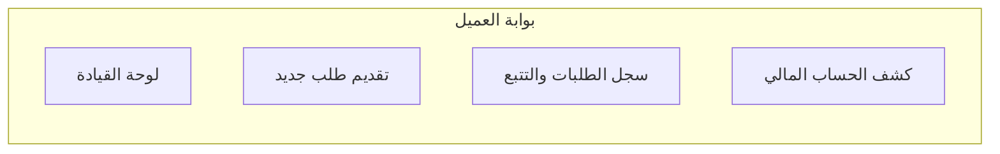
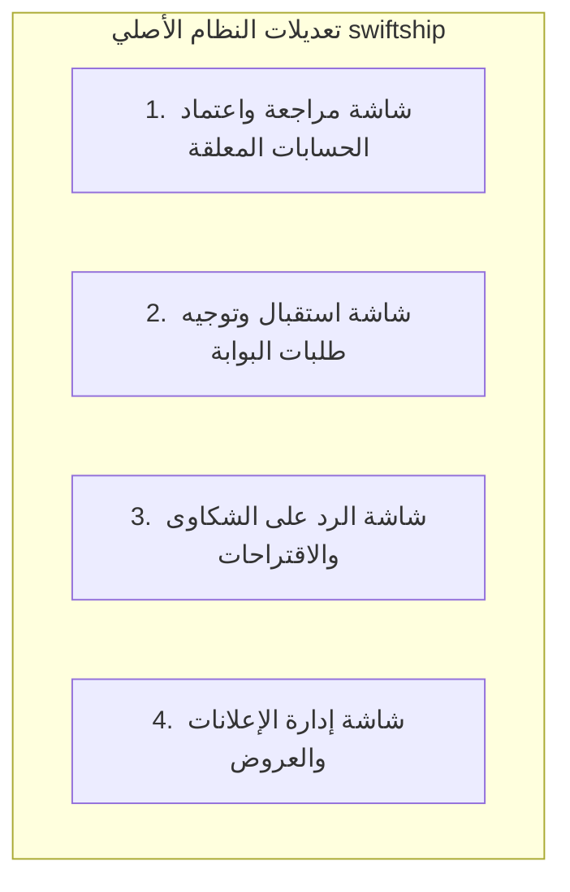
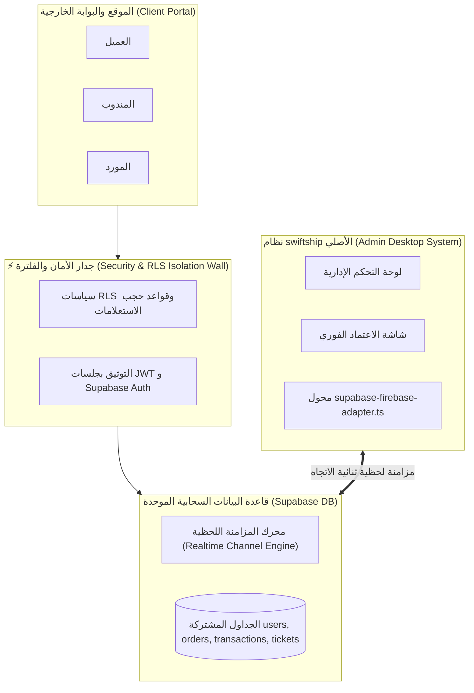

# وثيقة المواصفات التفصيلية للواجهات والكيانات وآليات الربط والعزل (UI, Entity & Isolation Specifications Document)

تعد هذه الوثيقة التفصيلية المرجع الشامل لكافة شاشات ومكونات موقع الويب وبوابات الخدمات الذاتية، وتحليلاً كاملاً لكيانات النظام الثلاثة (**عميل / مندوب / مورد**)، مع شرح دقيق لشبكة الاتصال والربط الفوري وجدار العزل الأمني بين الموقع الخارجي ونظام **swiftship** الأصلي.

---

# 1. الدليل الشامل لكافة واجهات النظام والموقع (Exhaustive Screen-by-Screen Specs)

---

## 1.1 شاشات الواجهة العامة للموقع (Public Landing Page Screens)

### 🖥️ 1. الواجهة الرئيسية للعامة (Public Landing Page View)
* **الهدف**: جذب العملاء الجدد، استعراض خدمات الشركة اللوجستية، وتتبع الشحنات فورياً بدون تسجيل.
* **محتويات الواجهة**:
  1. **الهيدر الرئيسي (Navbar)**:
     - شعار الشركة المضاء باللون الذهبي (`Luxury Gold`).
     - قائمة ملاحة سريعة: [الرئيسية | خدماتنا | المميزات والعروض | فروعنا العالمية | اتصل بنا].
     - زر التبديل السريع للمظهر (فاتح / داكن) وزر اللغة (عربي / English).
     - أزرار الحساب: [تسجيل الدخول] و [إنشاء حساب جديد].
  2. **قسم البطل (Hero Showcase & Fast Tracker)**:
     - عنوان ترويجي متحرك بخلفية زجاجية فاخرة.
     - **محرك تتبع الشحنات السريع**: حقل مدخل مائل لإدخال رقم التتبع (Tracking Number) مع زر [تتبع الآن] يفتح مودال التتبع الحي فوراً.
  3. **شبكة الخدمات اللوجستية (Logistics Services Grid)**:
     - كروت تفاعلية بأسلوب Glassmorphism تشمل: (الشحن المحلي السريع، التوريد والشحن من المصانع، الشحن الجوي والبحري الدولي، خدمات التغليف والتحميل).
  4. **شريط المميزات والعروض الاستثنائية (Features & Offers Carousel)**:
     - عرض الإعلانات والعروض الخصمية الفعالة المخصصة للعامة.
  5. **خريطة التواجد الجغرافي والعالمية (Interactive Global Footprint)**:
     - خريطة تفاعلية مدعومة بـ `Leaflet` تعرض نقاط فروع الشركة، المستودعات، ومسارات الشحن الدولية والمحلية.
  6. **عداد الإحصائيات الحية (Live Stats Counter)**:
     - عداد تلقائي يوضح: إجمالي الشحنات المسلمة، عدد العملاء المسجلين، ونسبة الالتزام بالتوصيل السريع.
  7. **آراء العملاء وتجارب النجاح (Testimonials Carousel)**:
     - عرض تقييمات العملاء والتشاركات التجارية.
  8. **الفوتير السفلي (Comprehensive Footer)**:
     - معلومات الترخيص الضريبي، سياسة الخصوصية، روابط التطبيق الذكي، وساعات العمل.

---

### 🖥️ 2. نافذة تتبع الشحنة المباشرة (Public Live Order Tracking Modal)
* **الهدف**: إظهار مسار حالة الشحنة بالتفصيل فور إدخال رقم التتبع.
* **محتويات الواجهة**:
  - شريط الخط الزمني الحركي (Status Timeline): (تم استلام الطلب ➔ جاري التجهيز ➔ جاري الشحن ➔ خرج للتوصيل ➔ تم التسليم).
  - تفاصيل الشحنة غير الحساسة: (المدينة المصدر، المدينة الواردة، تاريخ الاستلام المتوقع، اسم المندوب المسند مقترناً برقم التواصل).
  - خريطة مسار الشحنة بالوقت الحقيقي.

---

## 1.2 شاشات المصادقة والدخول (Auth & Security Screens)

### 🖥️ 1. شاشة تسجيل الدخول الموحدة (Unified Login Screen)
* **محتويات الواجهة**:
  - نموذج بسيط وأنيق يحتوي على: البريد الإلكتروني / رقم الهاتف، كلمة المرور، زر إظهار/إخفاء كلمة المرور.
  - خيار [تذكرني] لحفظ الجلسة الآمنة.
  - رابط [نسيت كلمة المرور؟] لإرسال رابط إعادة التعيين عبر Supabase Auth.
  - زر [تسجيل الدخول] الفاخر باللون الذهبي.
  - محول الوصول لصفحة إنشاء حساب جديد.

---

### 🖥️ 2. شاشة إنشاء حساب جديد (Role-Based Registration Screen)
* **محتويات الواجهة**:
  - **محدد نوع المستفيد الذكي (User Type Selector)**:
    - 🔷 **عميل (Customer)** -> تفعيل فوري تلقائي.
    - 🚚 **مندوب (Courier)** -> إيقاف مؤقت لحين موافقة الإدارة.
    - 🏭 **مورد / مصنع (Supplier)** -> إيقاف مؤقت لحين موافقة الإدارة.
  - **الحقول العامة**: الاسم الكامل، رقم الهاتف، البريد الإلكتروني، كلمة المرور وتأكيدها، العنوان والمدينة.
  - **الحقول المخصصة حسب النوع**:
    - *المندوب*: نوع المركبة، رقم الرخصة، رفع صورة الهوية الوطنية (`National ID`).
    - *المورد*: اسم الشحنة/المصنع، رفع السجل التجاري (`Commercial Register`).
  - زر [إنشاء الحساب الآن].

---

### 🖥️ 3. شاشة انتظار موافقة الإدارة (Pending Admin Approval Screen)
* **الهدف**: تظهر فقط للمندوب أو المورد بعد التسجيل وتمنعه من الوصول للبوابة حتى اعتماد حسابه من النظام الأصلي.
* **محتويات الواجهة**:
  - أيقونة انتظار حركية باللون الذهبي.
  - رسالة توضيحية: `"حسابك قيد المراجعة والتدقيق من قبل فريق إدارة swiftship. سيتم إشعارك فور الاعتماد والتفعيل."`
  - زر [إعادة فحص حالة الحساب] وزر [تسجيل الخروج].

---

## 1.3 شاشات بوابة العميل (Customer Portal Screens)

### 🖥️ 1. لوحة قيادة العميل (Customer Dashboard View)
* **محتويات الواجهة**:
  - **بطاقات المؤشرات الإحصائية**: (إجمالي طلباتي | طلبات قيد التوصيل | طلبات مكتملة | الرصيد المالي الحالي).
  - **جدول مختصر لأحدث الطلبات**: أحدث 5 شحنات مع شارات الحالة والتتبع المباشر.
  - **اختصارات سريعة**: [طلب شحن جديد]، [تحميل كشف الحساب].

---

### 🖥️ 2. شاشة تقديم طلب شحن / توريد جديد (New Order Request Form)
* **محتويات الواجهة**:
  - **بيانات المستلم**: اسم المستلم، رقم الهاتف، عنوان التسليم التفصيلي، والمدينة.
  - **بيانات الشحنة**: نوع البضاعة، الوزن الكلي التقديري (كجم)، الحجم (CBM في حالة طلبات المصانع)، خيارات الشحن (عادي، سريع، توريد مصنع).
  - **مُحاسب التكلفة الفوري (Instant Rate Estimator)**: يظهر التكلفة التقديرية التلقائية بناءً على مصفوفة أسعار الشركة.
  - **مرفقات الشحنة**: رفع صور المنتجات أو الفواتير التوضيحية.
  - زر [إرسال الطلب للمراجعة].

---

### 🖥️ 3. شاشة سجل الطلبات والتتبع الحي (Customer Orders & Live Tracking View)
* **محتويات الواجهة**:
  - شريط بحث وفلترة حسب الحالة وتاريخ الطلب.
  - جدول وكروت تفاعلية بالطلبات تشمل: رقم التتبع، تاريخ الطلب، المستلم، الحالة الحالية، التكلفة، وأزرار الإجراءات.
  - **زر [تتبع مسار الشحنة]**: يفتح الخريطة المباشرة مع موقع المندوب والشحنة.
  - **زر [تحميل الفاتورة PDF]**: توليد فاتورة رسمية بضغطة واحدة.

---

### 🖥️ 4. شاشة كشف الحساب المالي للعميل (Customer Statement of Account View)
* **محتويات الواجهة**:
  - **بطاقة الملخص المالي**: (إجمالي المدين | إجمالي الدائن | صافي الرصيد المتبقي).
  - **جدول الحركة المالية الشامل (Financial Ledger Table)**:
    - تاريخ السند، رقم المرجع، نوع العملية (قبض، دفع، تكلفة شحنة)، المبلغ بالعملة الرئيسية (USD/YER/SAR)، الرصيد التراكمي، والملاحظات.
  - أزرار تصدير كشف الحساب: [تصدير PDF رسمية للطباعة] و [تصدير Excel].

---

## 1.4 شاشات بوابة المندوب (Courier Portal Screens)

### 🖥️ 1. لوحة قيادة المندوب (Courier Dashboard View)
* **محتويات الواجهة**:
  - **زر التبديل الميداني (Availability Toggle)**: [جاهز لتلقي الطلبات 🟢 / غير متاح 🔴].
  - **بطاقات الملخص**: (المهام الحالية | الشحنات المسلمة اليوم | إجمالي العمولات المستحقة).
  - قائمة بالمهام العاجلة المسندة إليه من إدارة الشركة.

---

### 🖥️ 2. شاشة إدارة المهام والتوصيل الميداني (Assigned Deliveries & Maps View)
* **محتويات الواجهة**:
  - كروت المهام المسندة مرتبة حسب القرب الجغرافي والأولوية.
  - تفاصيل كارت التوصيل: اسم العميل والمستلم، رقم التواصل المباشر مع زر [اتصال تلفوني] وزر [مراسلة واتساب].
  - **زر [التوجيه بالخريطة - GPS Navigation]**: فتح خريطة التوجيه لموقع التسليم.
  - **زر [تحديث حالة التوصيل]**: يفتح مودال إثبات التسليم.

---

### 🖥️ 3. مودال إثبات التسليم والتوقيع (Handover Proof Modal)
* **محتويات الواجهة**:
  - خيارات التحديث: (تم التسليم بنجاح ✅ | تعذر التسليم مع ذكر السبب ❌).
  - **نافذة التوقيع الإلكتروني (Digital Signature Canvas)**: توقيع العميل بأصبعه أو القلم على الشاشة.
  - **التقاط صورة الإثبات**: رفع صورة الشحنة عند باب المستلم.

---

### 🖥️ 4. شاشة كشف حساب العمولات والأرباح (Courier Earnings & Financial Ledger)
* **محتويات الواجهة**:
  - جدول تفصيلي لكل شحنة تم توصيلها، قيمة العمولة المستحقة، والمبالغ النقدية المحصلة التي بحوزته كعهدة والمطلوب توريدها لصندوق الشركة.

---

## 1.5 شاشات بوابة المورد / المصنع (Supplier / Factory Portal Screens)

### 🖥️ 1. لوحة قيادة المورد (Supplier Dashboard View)
* **محتويات الواجهة**:
  - **ملخص التوريد**: (عدد طلبات المصنع | إجمالي الحجم CBM | إجمالي الوزن كجم | الرصيد المالي لدى الشركة).
  - شريط التنبيهات بالطلبات الجديدة الواردة من الشركة.

---

### 🖥️ 2. شاشة طلبات المصنع والشحنات الواردة (Incoming Factory Orders View)
* **محتويات الواجهة**:
  - جدول طلبات الشحن والتصنيع الواردة من إدارة الشركة.
  - شارات مرحلة التجهيز: (قيد التصنيع ⚙️ | جاري التغليف 📦 | جاهز للتحميل 🚢 | تم التسليم للميناء/الناقل ⚓).
  - **زر [تحديث الأوزان والـ CBM الفعلي]**: فتح مودال إدخال البيانات النهائية للتوريد.

---

### 🖥️ 3. شاشة كشف الحساب المالي للمورد (Supplier Financial Ledger View)
* **محتويات الواجهة**:
  - جدول المستحقات المالية عن عمليات التوريد، الفواتير المقبوضة، والسندات الآجلة المتبقية لدى الشركة.

---

## 1.6 الواجهات والخدمات المشتركة لجميع المستفيدين (Shared Universal Screens)

### 🖥️ 1. شاشة إعلانات وعروض الشركة (Company Announcements View)
* عرض كروت الإعلانات والعروض الترويجية المصممة ببطاقات زجاجية تفاعلية مع إمكانية التفاعل والمشاركة.

---

### 🖥️ 2. شاشة الملف الشخصي وإعدادات الأمان والمظهر (Profile & Settings View)
* **إدارة الحساب**: تحديث البيانات الشخصية والصورة والعنوان.
* **الأمان**: تغيير كلمة المرور وتصفح الجلسات النشطة.
* **إعدادات المظهر واللغة**: التبديل بين الوضع الفاتح والداكن وتغيير لغة البوابة (AR / EN).

---

### 🖥️ 3. شاشة تذاكر الدعم والشكاوى (Support & Suggestions Ticket View)
* **نموذج إرسال تذكرة جديدة**: اختيار النوع (اقتراح، شكوى، استفسار)، الموضـوع، ونـص الرسالة.
* **سجل التذاكر**: استعراض التذاكر السابقة، حالتها (مفتوحة، قيد المعالجة، تم الرد)، واستعراض رد إدارة الشركة المباشر.

---

### 🖥️ 4. محرك البحث العالمي الذكي (Global Search View)
* شريط بحث علوي يتيح للمستخدم البحث السريع في كل طلباته، إعلاناته، وسنداته المالية بكلمة مفتاحية أو رقم مرجعي.

---

## 1.7 الشاشات المضافة والمحدثة في النظام الأصلي (`swiftship`)

1. **شاشة مراجعة واعتماد الحسابات المعلقة (`Pending Approvals Queue`)**:
   - مضافة في صفحات `Couriers.tsx` و `Sources.tsx` بالنظام الأصلي.
   - تتيح للمدير فحص مستندات المندوب أو المورد المرفوعة والضغط على زر [اعتماد وتفعيل] وتعيين نسبة العمولة والحساب المالي التلقائي.
2. **شاشة استقبال وتوجيه طلبات البوابة (`Portal Orders Reception`)**:
   - تظهر الطلبات الجديدة القادمة من البوابة بشارة ملونة `[من البوابة]`.
   - زر [قبول الطلب وتعيين المندوب] مع إرسال إشعار فوري للعميل.
3. **شاشة إدارة وتذاكر الدعم (`Admin Ticket Management`)**:
   - استقبال تذاكر المستفيدين، كتابة الرد الإداري، وتحديث حالة التذكرة إلى "تم الرد/مغلقة".
4. **شاشة إدارة الإعلانات (`Admin Announcements Manager`)**:
   - إمكانية إضافة وتعديل وحذف الإعلانات والعروض التي تظهر بالموقع الخارجي.

---

# 2. التحليل التفصيلي لكيانات النظام الثلاثة (Entities Detailed Breakdown)

---

## 2.1 كيان العميل (Customer Entity)

| العنصر | التوضيح التفصيلي |
| :--- | :--- |
| **تعريف الكيان** | الشخص أو الجهة الخارجية المستفيدة من خدمات الشحن والتوصيل والتوريد الخاص بالشركة. |
| **دورة حياة الحساب** | تسجيل جديد ➔ تفعيل فوري تلقائي `approved` ➔ الدخول المباشر للبوابة. |
| **البيانات المخزنة** | الإسم الكامل، الهاتف، البريد، العنوان والمدينة، إحداثيات GPS، سجل الطلبات، وسجل الحركة المالية. |
| **المهام والعمليات المتاحة** | 1. تقديم طلب شحن/توريد جديد. 2. تتبع الشحنة حياً على الخريطة. 3. طباعة فاتورة الطلب PDF. 4. استعراض كشف الحساب المالي والتصدير. 5. تقديم اقتراح/شكوى ومتابعتها. |
| **الصلاحيات والحظر** | **صلاحيات محصورة**: رؤية بياناته وشحناته وسنداته فقط. **حظر مطلق**: لا يستطيع رؤية أي عملاء آخرين، أو مناديب، أو شجرة حسابات الشركة. |

---

## 2.2 كيان المندوب (Courier Entity)

| العنصر | التوضيح التفصيلي |
| :--- | :--- |
| **تعريف الكيان** | السائق أو المندوب الميداني المسؤول عن استلام وتوصيل الشحنات للعملاء. |
| **دورة حياة الحساب** | تسجيل جديد ➔ حالة معلقة `pending_approval` ➔ انتظار موافقة الأدمن بالنظام الأصلي ➔ تفعيل وتعيين العمولة ➔ حالة معتمدة `approved`. |
| **البيانات المخزنة** | الإسم الكامل، الهاتف، البريد، نوع المركبة، رقم الرخصة، صورة الهوية الوطنية، نسبة العمولة، ورصيد العهدة. |
| **المهام والعمليات المتاحة** | 1. التبديل بين (متاح للتوصيل / غير متاح). 2. استعراض قائمة المهام المسندة إليه. 3. التوجيه بالخرائط GPS إلى موقع التسليم. 4. إثبات التسليم عبر التوقيع الرقمي والصورة. 5. استعراض كشف العمولات والعهد المحصلة. |
| **الصلاحيات والحظر** | **صلاحيات محصورة**: رؤية الطلبات المسندة إليه فقط وعمولاته الخاصة. **حظر مطلق**: حظر تعديل أسعار الشحنات، أو الوصول لكشوفات حسابات العملاء المباشرة. |

---

## 2.3 كيان المورد / المصنع (Supplier Entity)

| العنصر | التوضيح التفصيلي |
| :--- | :--- |
| **تعريف الكيان** | المصنع أو شركة التوريد الخارجية التي توفر البضائع وطلبات التوريد الدولية/المحلية للشركة. |
| **دورة حياة الحساب** | تسجيل جديد ➔ حالة معلقة `pending_approval` ➔ مراجعة السجل التجاري من الأدمن ➔ اعتماد وتفعيل الحساب. |
| **البيانات المخزنة** | اسم الشركة/المصنع، الهاتف، البريد، العنوان، السجل التجاري، أسعار شحن الـ CBM والوزن، والحساب المالي. |
| **المهام والعمليات المتاحة** | 1. استلام طلبات التصنيع والتوريد الصادرة من الشركة. 2. تحديث مرحلة التجهيز (قيد التصنيع، جاهز للتحميل). 3. تحديث الأوزان النهائية وأحجام CBM للم حمولات. 4. استعراض كشف الحساب المالي للمورد ومتابعة الفواتير. |
| **الصلاحيات والحظر** | **صلاحيات محصورة**: رؤية طلبات التوريد الموجهة لمصنعه فقط وسنداته المالية. **حظر مطلق**: حظر رؤية الموردين الآخرين أو عملاء التجزئة الداخليين. |

---

# 3. شبكة الاتصال والربط وآليات العزل بين البوابة والنظام الأصلي

---

## 3.1 آلية الاتصال اللحظي الموحد (Realtime Engine)
1. **قنوات المزامنة الحية (PostgreSQL Realtime Channels)**:
   - يعمل نظام `swiftship` الأصلي وموقع الويب عبر محول التوافق `supabase-firebase-adapter.ts` الذي يستمع لقنوات الأحداث `postgres_changes`.
   - **مثال حركي**: فور تسجيل مندوب جديد عبر البوابة، يُرسل إشعار حي فوراً لشاشة الأدمن بالنظام الأصلي دون الحاجة لتحديث الصفحة. وفور ضغط الأدمن على زر [اعتماد]، تتغير حالة الحساب في البوابة فوراً إلى `approved` ويتفعل حساب المندوب بنفس اللحظة.

2. **التكامل المالي الموحد (Shared Financial Ledger)**:
   - يتم تقييد عمليات الشحنات والسندات في جدول `transactions` الموحد، مما يضمن أن السندات التي يصدرها المحاسب بالنظام الأصلي تنعكس فوراً في كشف حساب العميل أو المورد بالبوابة الخارجية.

---

## 3.2 مصفوفة العزل الفاصلة بين النظام الداخلي والبوابة (Isolation Matrix)

جدول يوضح الفصل الحازم المطلق بين البيانات المتاحة بالنظام الداخلي والبيانات المتاحة بالبوابة الخارجية:

| الكيان / البيانات | النواة الداخلية بالنظام الأصلي (`swiftship`) | موقع الويب والبوابة الخارجية (Portal) |
| :--- | :--- | :--- |
| **تقارير الأرباح العامة وصناديق الشركة** | 🔓 متاح ومحمي بصلاحية مدير/محاسب | 🚫 **محظور تماماً ومحجوب بـ RLS** |
| **بيانات الموظفين والأدوار الإدارية** | 🔓 متاح ومحمي بصلاحية مدير | 🚫 **محظور تماماً ولا يظهر بالموقع** |
| **كشوفات حسابات جميع العملاء** | 🔓 متاح للموظفين المصرح لهم | 🔐 **العميل يرى كشف حسابه الشخصي فقط** |
| **قائمة المناديب والعمولات الشاملة** | 🔓 متاح لإدارة المناديب | 🔐 **المندوب يرى عمولاته الشخصية فقط** |
| **بيانات طلبات الموردين المصنعية** | 🔓 متاح لإدارة المشتريات | 🔐 **المورد يرى طلباته الخاصة بمصنعه فقط** |

---

## 💡 النتيجة والتوجيه

هذه الوثيقة التفصيلية تقدم **تحليلاً شاملاً لكافة الشاشات، والكيانات، وشبكة الربط والعزل الأمني**.
يمكنك اعتماد الخريطتين التنفيذيتين (`implementation_plan.md` و `ui_and_entity_specifications.md`) لنبدأ تنفيذ المرحلة الأولى فور موافقتك!
